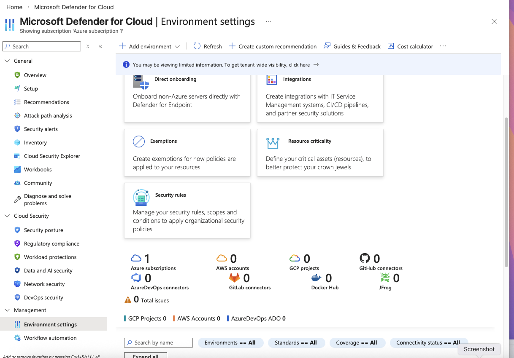
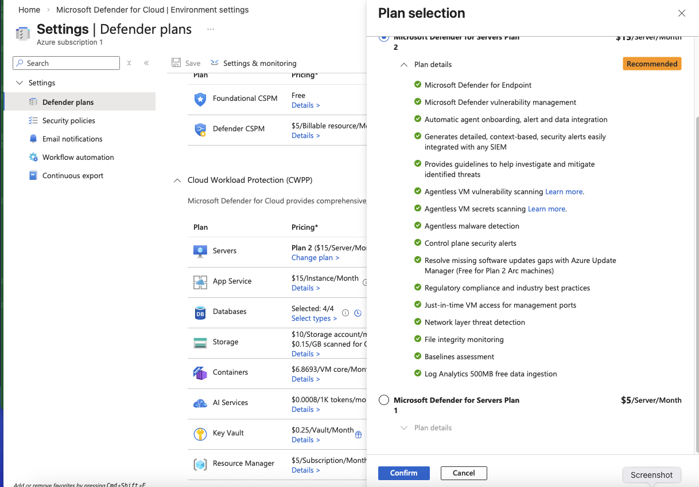
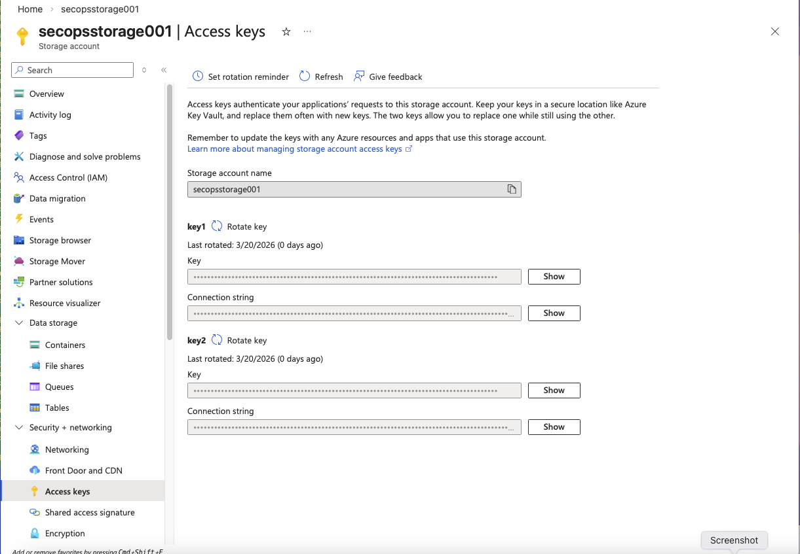
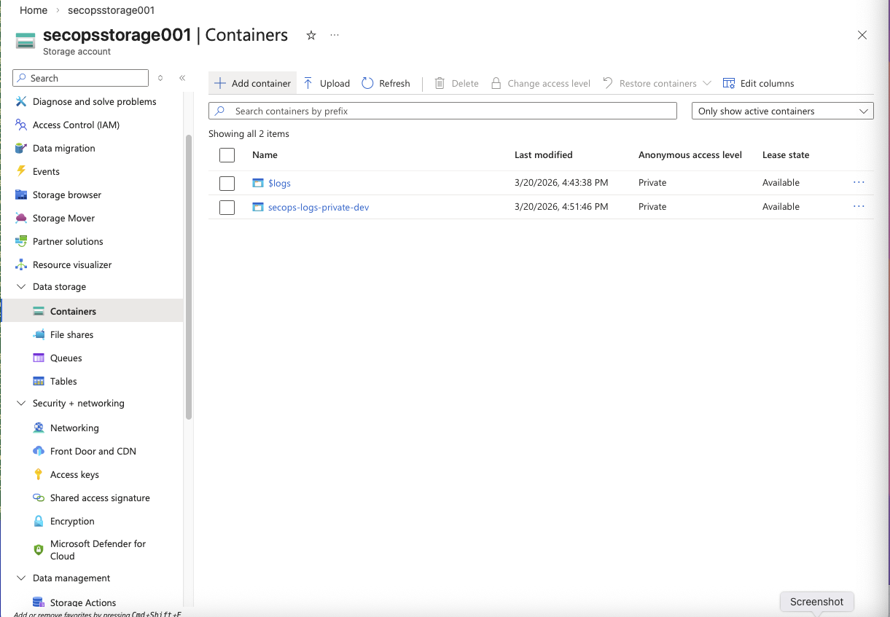
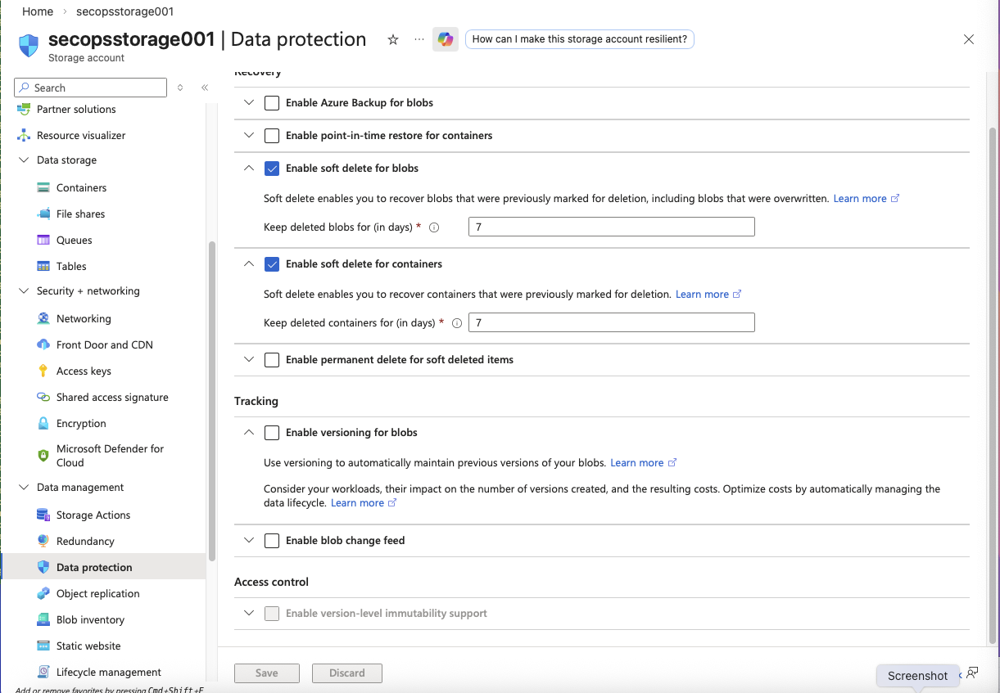
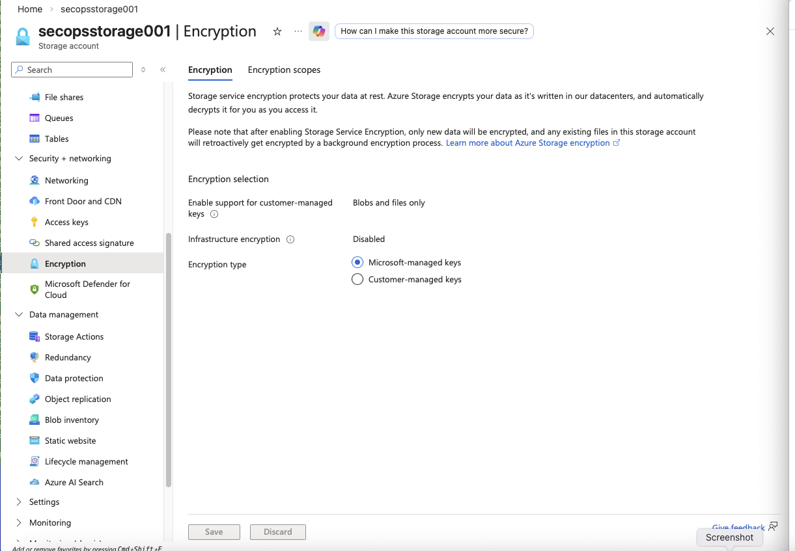
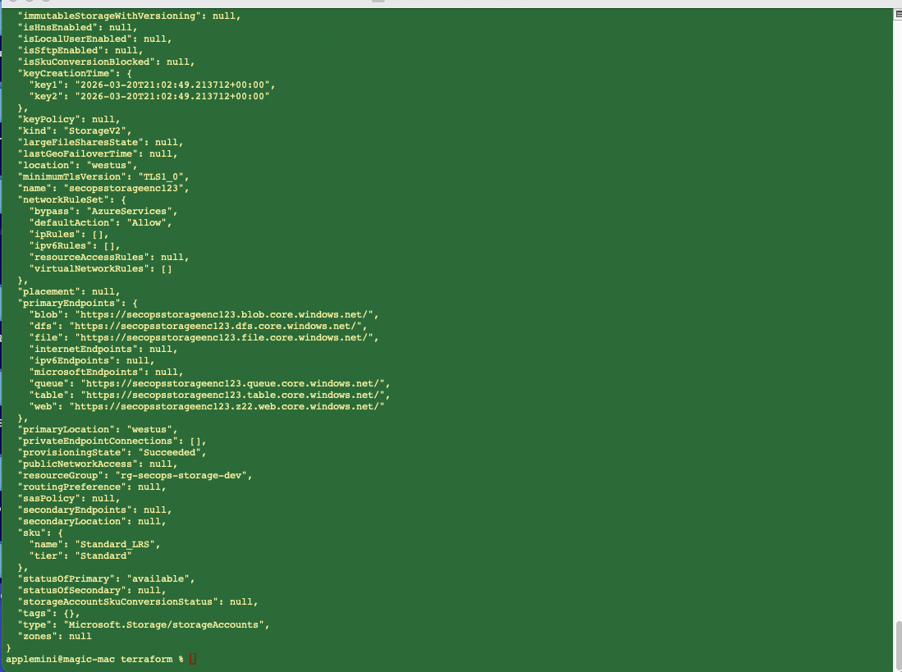
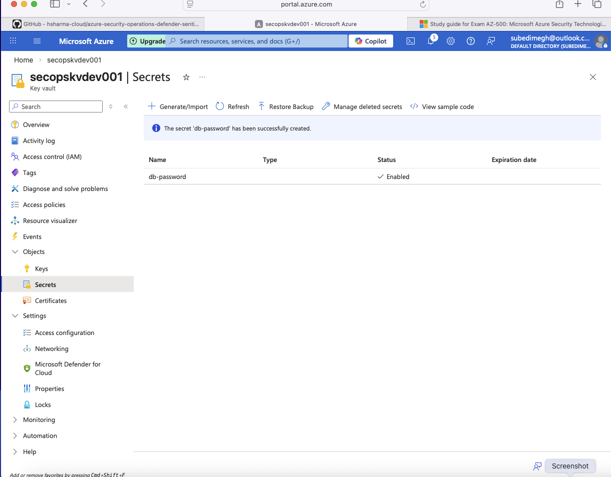
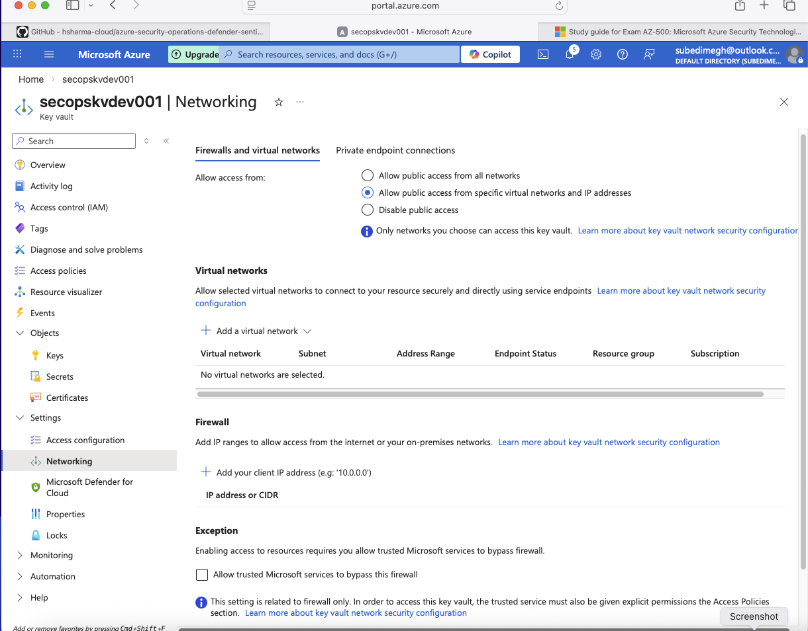
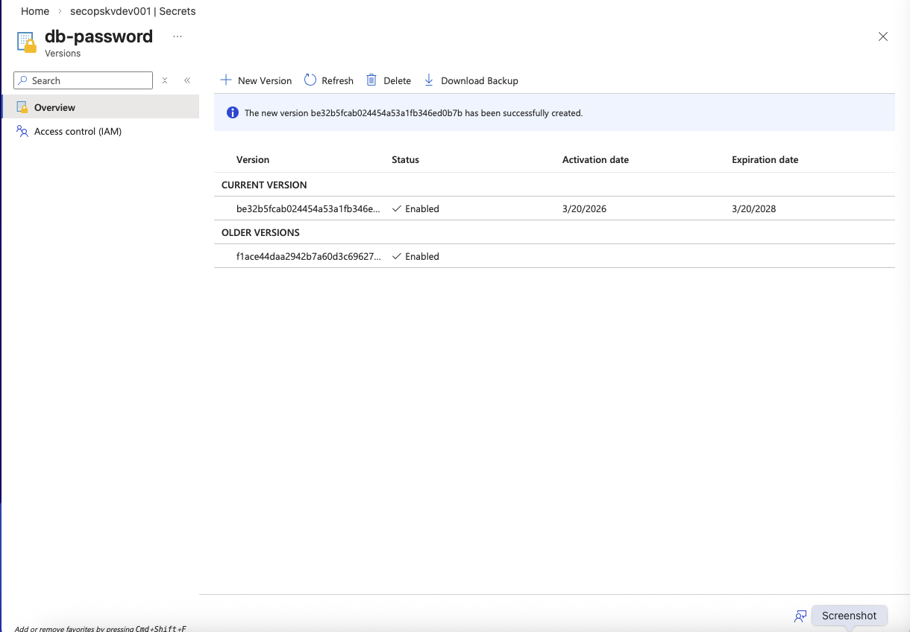

# 🛡️ Azure Security Operations with Defender & Sentinel

## 📌 Overview
This project demonstrates a cloud-native security monitoring environment built using Terraform and Azure security services.

It includes:
- Infrastructure provisioning with Terraform
- Log collection using Log Analytics
- SIEM using Microsoft Sentinel
- Detection using KQL analytics rules
- Security posture with Microsoft Defender for Cloud

---

## 🏗️ Architecture Diagram

```
                Azure Subscription
                        │
                        ▼
        +----------------------------------+
        | Resource Group                   |
        | rg-secops-monitoring-dev        |
        +----------------------------------+
                        │
        ┌───────────────┼───────────────┐
        │               │               │
        ▼               ▼               ▼
+---------------+  +----------------+  +----------------------+
| Virtual       |  | Log Analytics  |  | Microsoft Defender   |
| Network       |  | Workspace      |  | for Cloud            |
| + Subnet      |  +--------+-------+  +----------+-----------+
+-------+-------+           │                     │
        │                   ▼                     │
        │        +---------------------------+    │
        │        | Microsoft Sentinel (SIEM) |<---+
        │        +------------+--------------+
        │                     │
        │                     ▼
        │        +---------------------------+
        │        | Analytics Rule (KQL)      |
        │        | Failed Login Detection    |
        │        +------------+--------------+
        │                     │
        │                     ▼
        │        +---------------------------+
        │        | Incidents & Alerts        |
        │        +---------------------------+
```

---

## 🔄 Data Flow

1. Azure resources generate logs  
2. Logs are stored in Log Analytics  
3. Microsoft Sentinel analyzes logs  
4. KQL rules detect suspicious activity  
5. Alerts and incidents are generated  
6. Microsoft Defender provides recommendations  

---

## 🏗️ Infrastructure Components

- Resource Group  
- Virtual Network & Subnet  
- Network Interface & Public IP  
- Log Analytics Workspace  
- Microsoft Sentinel  
- Analytics Rule  
- Microsoft Defender for Cloud  

---

## ⚙️ Technologies Used

- Terraform  
- Microsoft Azure  
- Log Analytics  
- Microsoft Sentinel  
- Microsoft Defender for Cloud  
- KQL (Kusto Query Language)  

---

## 🚀 Deployment Steps

### Initialize
```
terraform init
```

### Validate
```
terraform validate
```

### Plan
```
terraform plan
```

### Apply
```
terraform apply
```

---

## 🔍 Security Features

- Centralized logging  
- SIEM with Sentinel  
- Detection rule for failed logins  
- Defender for Cloud enabled  
- Structured naming convention  

---

## 📸 Deployment Screenshots

### Terraform Validate


### Terraform Plan


### Core Infrastructure


### Log Analytics


### Detection Rule


### Defender


---


## 📸 Architecture & Security Implementation

### 🏗️ Terraform Deployment

#### Validate


#### Plan


#### Core Infrastructure


#### Log Analytics


#### Defender for Cloud


#### Detection Rule


---

### 🛡️ Web Application Firewall (WAF)


---

### 📦 Azure Container Registry (ACR) - RBAC


---

### 🚀 Container App Deployment


---

### 📊 Container App Monitoring


## 📸 Azure Security Operations Overview

---

### 🏗️ Infrastructure (Terraform)


---

### 🛡️ Network Security (WAF)


---

### 📦 Identity & Container Security


---

### 🛡️ Microsoft Defender for Cloud




---

### 💾 Storage Security







---

### 🔐 Key Vault






## 🧠 Lessons Learned

- Terraform state management is critical  
- Never commit `.terraform` directory  
- Azure capacity varies by region  
- Security must be added incrementally  
- Debugging builds real-world skills  

---

## 🎯 Future Improvements

- Connect VM for live monitoring  
- Generate real attack logs  
- Add automation (playbooks)  
- Implement Azure Policy  

---

## 💼 Author

Hari Sharma  
Cloud Security Engineer | Azure | AWS | Terraform
